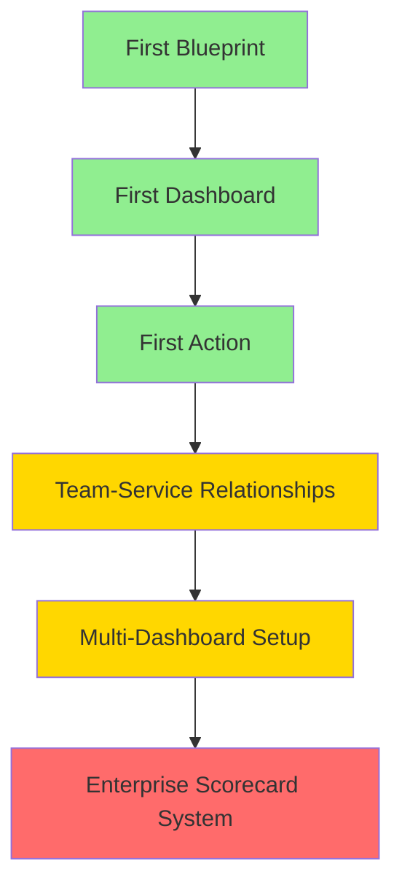

# Port Workshop Challenges

This directory contains progressive challenges designed to build Port expertise from beginner to advanced levels.

## Challenge Structure

### 🟢 Beginner Challenges
**Focus**: Learning individual Port concepts with detailed guidance

- **[First Blueprint](beginner/first-blueprint.md)** - Create your first data model
- **[First Dashboard](beginner/first-dashboard.md)** - Build visualizations and widgets  
- **[First Action](beginner/first-action.md)** - Create self-service workflows

**Estimated Time**: 20-40 minutes each  
**Prerequisites**: Complete corresponding modules

### 🟡 Intermediate Challenges  
**Focus**: Integrating multiple Port concepts with real-world scenarios

- **[Team-Service Relationships](intermediate/team-service-relationships.md)** - Connect data models with integrations
- **[Multi-Dashboard Setup](intermediate/multi-dashboard-setup.md)** - Create role-based dashboard views

**Estimated Time**: 45-70 minutes each  
**Prerequisites**: Complete beginner challenges

### 🔴 Advanced Challenges
**Focus**: Complex real-world scenarios with minimal guidance

- **[Enterprise Scorecard System](advanced/enterprise-scorecard-system.md)** - Design comprehensive quality measurement system

**Estimated Time**: 90-120 minutes each  
**Prerequisites**: Complete intermediate challenges

## Getting Started

### Prerequisites
- Access to a Port instance
- Completed relevant workshop modules
- Basic understanding of YAML/JSON
- Port API token (for validation)

### Challenge Flow
1. **Start with Beginner** - Build foundational skills
2. **Progress to Intermediate** - Learn integration patterns  
3. **Tackle Advanced** - Apply skills to complex scenarios

### Validation
Each challenge includes:
- ✅ Success criteria checklists
- 🔧 Validation commands
- 🐛 Common issues and solutions
- 🎯 Bonus challenges for extra practice

## Using the Validation System

### Automated Validation
```bash
# Validate specific challenge
./validate-challenge.sh beginner first-blueprint

# Validate all challenges at a level
./validate-challenge.sh beginner all
./validate-challenge.sh intermediate all

# Get help
./validate-challenge.sh --help
```

### Manual Validation
Each challenge includes detailed validation steps you can follow manually.

## Challenge Progression



## Learning Objectives

### Beginner Level
- Understand Port's core concepts
- Create basic blueprints and entities
- Build simple dashboards
- Configure self-service actions

### Intermediate Level  
- Design connected data models
- Implement automated data synchronization
- Create role-specific user experiences
- Integrate multiple Port features

### Advanced Level
- Architect comprehensive Port solutions
- Design for scale and maintainability
- Create business value through automation
- Implement quality measurement systems

## Tips for Success

### General Approach
1. **Read the scenario carefully** - Understand the business context
2. **Plan before implementing** - Sketch out your approach
3. **Start simple** - Build incrementally
4. **Test frequently** - Validate as you go
5. **Document learnings** - Capture insights for future reference

### Common Patterns
- **Data First** - Design your data model before building interfaces
- **User-Centric** - Consider who will use each feature
- **Automation-Friendly** - Design for automated data updates
- **Scalable** - Consider how solutions will grow

### Getting Help
- Check the validation steps for troubleshooting
- Review the examples directory for reference implementations
- Consult Port documentation for detailed API information
- Use the workshop modules for concept review

## Challenge Templates

### Creating New Challenges
Each challenge should include:
- Clear objective and scenario
- Detailed requirements
- Step-by-step instructions (beginner) or minimal guidance (advanced)
- Success criteria checklist
- Validation steps
- Common issues and solutions
- Bonus challenges
- Learning notes section

### Validation Requirements
- Automated validation scripts
- Manual validation steps
- Success criteria checklists
- Performance benchmarks (where applicable)

---

**Ready to start?** Begin with [First Blueprint](beginner/first-blueprint.md) and work your way through the progressive challenge system!